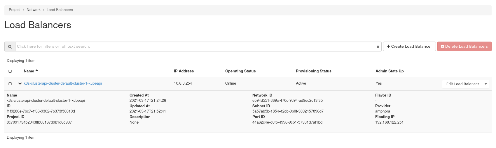
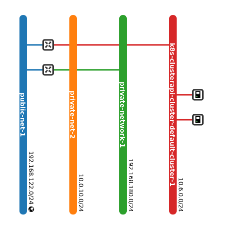
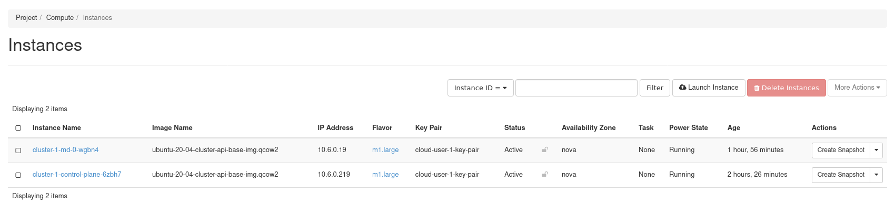
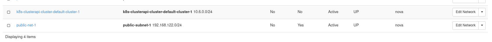
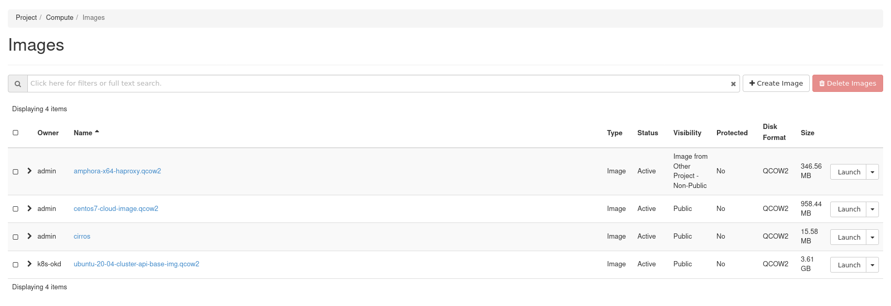
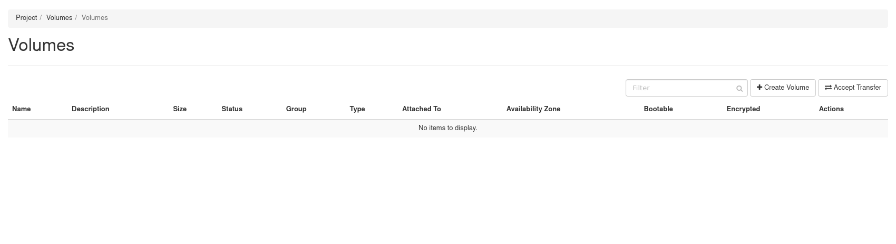

# Using Cluster API To Create K8S Cluster On OpenStack

This experiment lab is used to using Cluster API to create a K8S Cluster on OpenStack Cloud

## Environment

### OpenStack

OpenStack Cloud 2 nodes installed by `kolla-ansible`, installed services:

- Octavia
- Nova
- Cinder (LVM)
- ...

### Cluster-API Controller K8S Cluster

Install in single-node, using Kind to create.

## Steps

### Ensure OpenStack Cloud environment

### Using Cluster-API to create a workload k8s cluster

Perform on controller node folowing steps

Install `kubectl` on controller node

Create `Cluster-API Controller K8S Cluster` by kind: `kind create cluster`

Install `clusterctl`

Install Cluster API OpenStack Cloud Provider

```bash
clusterctl init --infrastructure openstack
```

Build Cluster API Workload VM Image using image-builder: https://image-builder.sigs.k8s.io/capi/providers/openstack.html

Upload Created Image to OpenStack Cloud using command: `openstack image create ...`

Download OpenStack credential config file `clouds.yaml` from OpenStack Horizon

Create Cluster API OpenStack Required Env By Command:

```shell
wget https://raw.githubusercontent.com/kubernetes-sigs/cluster-api-provider-openstack/master/templates/env.rc -O /tmp/env.rc
source /tmp/env.rc clouds.yaml openstack
```

following BASH ENV will be exported:

- OPENSTACK_CLOUD_PROVIDER_CONF_B64
- OPENSTACK_CLOUD
- OPENSTACK_CLOUD_CACERT_B64
- OPENSTACK_CLOUD_YAML_B64

Export another required enviroment variables to bash env:

```shell
# The list of nameservers for OpenStack Subnet being created.
# Set this value when you need create a new network/subnet while the access through DNS is required.
export OPENSTACK_DNS_NAMESERVERS=8.8.8.8
export OPENSTACK_FAILURE_DOMAIN=nova
export OPENSTACK_CONTROL_PLANE_MACHINE_FLAVOR=m1.large 
export OPENSTACK_NODE_MACHINE_FLAVOR=m1.large
export OPENSTACK_IMAGE_NAME=ubuntu-20-04-cluster-api-base-img.qcow2 
export OPENSTACK_SSH_KEY_NAME=cloud-user-1-key-pair 
```

**Note:** NODE Flavor must be larger than 20 GB

Generate workload cluster configuration file:

```bash
clusterctl config cluster cluster-1 \
  --kubernetes-version v1.18.16 \
  --control-plane-machine-count=1 \
  --worker-machine-count=1 \
  > cluster-1.yaml
```

Update cluster file info, example change `pod cidrBlocks` to another subnet

```yaml
  clusterNetwork:
    pods:
      cidrBlocks:
      - 172.17.0.0/16

```

Create workload cluster by command:

```bash
kubectl apply -f cluster-1.yaml 

# OUTPUT
cluster.cluster.x-k8s.io/cluster-1 created
openstackcluster.infrastructure.cluster.x-k8s.io/cluster-1 created
kubeadmcontrolplane.controlplane.cluster.x-k8s.io/cluster-1-control-plane created
openstackmachinetemplate.infrastructure.cluster.x-k8s.io/cluster-1-control-plane created
machinedeployment.cluster.x-k8s.io/cluster-1-md-0 created
openstackmachinetemplate.infrastructure.cluster.x-k8s.io/cluster-1-md-0 created
kubeadmconfigtemplate.bootstrap.cluster.x-k8s.io/cluster-1-md-0 created
secret/cluster-1-cloud-config created

```

Check worload cluster creating progress

```shell
kubectl get cluster --all-namespaces

NAMESPACE   NAME        PHASE
default     cluster-1   Provisioning


kubectl describe cluster cluster-1

Name:         cluster-1
Namespace:    default
Labels:       <none>
Annotations:  <none>
API Version:  cluster.x-k8s.io/v1alpha3
Kind:         Cluster
Metadata:
  Creation Timestamp:  2021-03-17T00:56:00Z
  Finalizers:
    cluster.cluster.x-k8s.io
  Generation:  1
  Managed Fields:
    API Version:  cluster.x-k8s.io/v1alpha3
    Fields Type:  FieldsV1
    fieldsV1:
      f:metadata:
        f:annotations:
          .:
          f:kubectl.kubernetes.io/last-applied-configuration:
      f:spec:
        .:
        f:clusterNetwork:
          .:
          f:pods:
            .:
            f:cidrBlocks:
          f:serviceDomain:
        f:controlPlaneRef:
          .:
          f:apiVersion:
          f:kind:
          f:name:
        f:infrastructureRef:
          .:
          f:apiVersion:
          f:kind:
          f:name:
    Manager:      kubectl-client-side-apply
    Operation:    Update
    Time:         2021-03-17T00:56:00Z
    API Version:  cluster.x-k8s.io/v1alpha3
    Fields Type:  FieldsV1
    fieldsV1:
      f:metadata:
        f:finalizers:
          .:
          v:"cluster.cluster.x-k8s.io":
      f:status:
        .:
        f:conditions:
        f:observedGeneration:
        f:phase:
    Manager:         manager
    Operation:       Update
    Time:            2021-03-17T00:56:01Z
  Resource Version:  19995
  UID:               ad624275-60ad-4b6a-9f96-ce1142d58ff3
Spec:
  Cluster Network:
    Pods:
      Cidr Blocks:
        172.17.0.0/16
    Service Domain:  cluster.local
  Control Plane Endpoint:
    Host:  
    Port:  0
  Control Plane Ref:
    API Version:  controlplane.cluster.x-k8s.io/v1alpha3
    Kind:         KubeadmControlPlane
    Name:         cluster-1-control-plane
    Namespace:    default
  Infrastructure Ref:
    API Version:  infrastructure.cluster.x-k8s.io/v1alpha3
    Kind:         OpenStackCluster
    Name:         cluster-1
    Namespace:    default
Status:
  Conditions:
    Last Transition Time:  2021-03-17T00:56:01Z
    Reason:                WaitingForControlPlane
    Severity:              Info
    Status:                False
    Type:                  Ready
    Last Transition Time:  2021-03-17T00:56:01Z
    Reason:                WaitingForControlPlane
    Severity:              Info
    Status:                False
    Type:                  ControlPlaneReady
    Last Transition Time:  2021-03-17T00:56:01Z
    Reason:                WaitingForInfrastructure
    Severity:              Info
    Status:                False
    Type:                  InfrastructureReady
  Observed Generation:     1
  Phase:                   Provisioning
Events:                    <none>

```


### Verifying

```shell

[cloud@bastion01 cluster-api]$ kubectl get cluster --all-namespaces
NAMESPACE   NAME        PHASE
default     cluster-1   Provisioned
[cloud@bastion01 cluster-api]$ kubectl describe cluster cluster-1
Name:         cluster-1
Namespace:    default
Labels:       <none>
Annotations:  <none>
API Version:  cluster.x-k8s.io/v1alpha3
Kind:         Cluster
Metadata:
  Creation Timestamp:  2021-03-18T16:14:23Z
  Finalizers:
    cluster.cluster.x-k8s.io
  Generation:  2
  Managed Fields:
    API Version:  cluster.x-k8s.io/v1alpha3
    Fields Type:  FieldsV1
    fieldsV1:
      f:metadata:
        f:annotations:
          .:
          f:kubectl.kubernetes.io/last-applied-configuration:
      f:spec:


[cloud@bastion01 kubectl -n capo-system logs -l control-plane=capo-controller-manager -c manager

I0318 18:17:58.796234       1 loadbalancer.go:541] controllers/OpenStackCluster "msg"="Waiting for loadbalancer" "cluster"="cluster-1" "namespace"="default" "openStackCluster"="cluster-1" "id"="f1f9280e-7bc7-4f66-9302-7b373f56010d" "targetStatus"="ACTIVE"
I0318 18:17:58.942933       1 loadbalancer.go:541] controllers/OpenStackCluster "msg"="Waiting for loadbalancer" "cluster"="cluster-1" "namespace"="default" "openStackCluster"="cluster-1" "id"="f1f9280e-7bc7-4f66-9302-7b373f56010d" "targetStatus"="ACTIVE"
I0318 18:17:59.106384       1 openstackcluster_controller.go:294] controllers/OpenStackCluster "msg"="Reconciled Cluster create successfully" "cluster"="cluster-1" "namespace"="default" "openStackCluster"="cluster-1" 
I0318 18:22:35.937965       1 openstackmachine_controller.go:353] controllers/OpenStackMachine "msg"="Reconciling Machine create started" "cluster"="cluster-1" "machine"="cluster-1-control-plane-jb4wl" "namespace"="default" "openStackCluster"="cluster-1" "openStackMachine"="cluster-1-control-plane-6zbh7" 
I0318 18:22:35.938182       1 openstackmachine_controller.go:353] controllers/OpenStackMachine "msg"="Reconciling Machine create started" "cluster"="cluster-1" "machine"="cluster-1-md-0-8688c884d4-sjzw6" "namespace"="default" "openStackCluster"="cluster-1" "openStackMachine"="cluster-1-md-0-wgbn4" 
I0318 18:22:36.529210       1 openstackmachine_controller.go:405] controllers/OpenStackMachine "msg"="Machine instance is ACTIVE" "cluster"="cluster-1" "machine"="cluster-1-control-plane-jb4wl" "namespace"="default" "openStackCluster"="cluster-1" "openStackMachine"="cluster-1-control-plane-6zbh7" "instance-id"="7fea4b4a-ab97-4370-8959-573277312497"
I0318 18:22:36.529278       1 loadbalancer.go:217] controllers/OpenStackMachine "msg"="Reconciling loadbalancer" "cluster"="cluster-1" "machine"="cluster-1-control-plane-jb4wl" "namespace"="default" "openStackCluster"="cluster-1" "openStackMachine"="cluster-1-control-plane-6zbh7" "name"="k8s-clusterapi-cluster-default-cluster-1-kubeapi"
I0318 18:22:36.576566       1 openstackmachine_controller.go:405] controllers/OpenStackMachine "msg"="Machine instance is ACTIVE" "cluster"="cluster-1" "machine"="cluster-1-md-0-8688c884d4-sjzw6" "namespace"="default" "openStackCluster"="cluster-1" "openStackMachine"="cluster-1-md-0-wgbn4" "instance-id"="f03520b0-f7f5-4a59-a36b-dd18c2e65fe6"
I0318 18:22:36.576603       1 openstackmachine_controller.go:433] controllers/OpenStackMachine "msg"="Reconciled Machine create successfully" "cluster"="cluster-1" "machine"="cluster-1-md-0-8688c884d4-sjzw6" "namespace"="default" "openStackCluster"="cluster-1" "openStackMachine"="cluster-1-md-0-wgbn4" 
I0318 18:22:36.774826       1 openstackmachine_controller.go:433] controllers/OpenStackMachine "msg"="Reconciled Machine create successfully" "cluster"="cluster-1" "machine"="cluster-1-control-plane-jb4wl" "namespace"="default" "openStackCluster"="cluster-1" "openStackMachine"="cluster-1-control-plane-6zbh7" 


[cloud@bastion01 cluster-api]$ kubectl get cluster --all-namespaces
NAMESPACE   NAME        PHASE
default     cluster-1   Provisioned
[cloud@bastion01 cluster-api]$ kubectl get kubeadmcontrolplane --all-namespaces
NAMESPACE   NAME                      INITIALIZED   API SERVER AVAILABLE   VERSION    REPLICAS   READY   UPDATED   UNAVAILABLE
default     cluster-1-control-plane   true                                 v1.18.16   1                  1         1
[cloud@bastion01 cluster-api]$ clusterctl get kubeconfig cluster-1 > cluster-1.kubeconfig


[cloud@bastion01 cluster-api]$ kubectl --kubeconfig=./cluster-1.kubeconfig get nodes
NAME                            STATUS     ROLES    AGE     VERSION
cluster-1-control-plane-6zbh7   NotReady   master   19m     v1.18.15
cluster-1-md-0-wgbn4            NotReady   <none>   9m48s   v1.18.15

<Missing CNI>

```

## Workload Cluster Intialization Process:

- Create Private Network/Subnet/DNS Nameservers
- Create Router between Private Network and External Network
- Create Load Balancer, assign Floating IP to Load Balancer
- Create Master Node, then Cloud Init run bootstrap controller on Master Node   => Cluster API Controller wait for Master Endpoint to available
- Create Worker Node, then Cloud Init run bootstrap worker on Worker Node.

## Workload Cluster Features

- CNI: No
- Monitoring: No
- Logging: No
- Backup etcd data mechanism: Not Tested

## Workload Cluster Features

- Auto provision Controller/Worker VMs: Yes
- Cluster Resizable: Yes
- Manual Replace Unhealthy Nodes: Not Tested
- Auto Replace Unhealthy Nodes: Not Tested
- Upgrade Cluster to new Version: Not Tested

## Workload Cluster Screenshot









## Troubleshooting

Using theses command to check what happended with worload cluster creating progress:

```bash
kubectl -n capo-system logs -l control-plane=capo-controller-manager -c manager

# Output
I0317 01:00:31.315853       1 floatingip.go:102] controllers/OpenStackCluster "msg"="Waiting for floatingIP" "cluster"="cluster-1" "namespace"="default" "openStackCluster"="cluster-1" "id"="c3675b08-701b-4b67-8511-0d2f16a09c48" "targetStatus"="ACTIVE"
I0317 01:00:31.484341       1 loadbalancer.go:541] controllers/OpenStackCluster "msg"="Waiting for loadbalancer" "cluster"="cluster-1" "namespace"="default" "openStackCluster"="cluster-1" "id"="caba94c3-f2df-44a2-953b-fef2cd6c3cbd" "targetStatus"="ACTIVE"
I0317 01:00:31.607471       1 loadbalancer.go:552] controllers/OpenStackCluster "msg"="Waiting for listener" "cluster"="cluster-1" "namespace"="default" "openStackCluster"="cluster-1" "id"="298ca16b-c142-4b82-b55c-2f489a03574f" "targetStatus"="ACTIVE"
I0317 01:00:31.839318       1 loadbalancer.go:541] controllers/OpenStackCluster "msg"="Waiting for loadbalancer" "cluster"="cluster-1" "namespace"="default" "openStackCluster"="cluster-1" "id"="caba94c3-f2df-44a2-953b-fef2cd6c3cbd" "targetStatus"="ACTIVE"
I0317 01:00:32.030542       1 loadbalancer.go:541] controllers/OpenStackCluster "msg"="Waiting for loadbalancer" "cluster"="cluster-1" "namespace"="default" "openStackCluster"="cluster-1" "id"="caba94c3-f2df-44a2-953b-fef2cd6c3cbd" "targetStatus"="ACTIVE"
I0317 01:00:32.273806       1 openstackcluster_controller.go:294] controllers/OpenStackCluster "msg"="Reconciled Cluster create successfully" "cluster"="cluster-1" "namespace"="default" "openStackCluster"="cluster-1" 
I0317 01:00:34.227705       1 openstackmachine_controller.go:346] controllers/OpenStackMachine "msg"="Waiting for bootstrap data to be available" "cluster"="cluster-1" "machine"="cluster-1-md-0-8688c884d4-mjgxg" "namespace"="default" "openStackCluster"="cluster-1" "openStackMachine"="cluster-1-md-0-88sl5" 
I0317 01:00:39.449450       1 openstackmachine_controller.go:346] controllers/OpenStackMachine "msg"="Waiting for bootstrap data to be available" "cluster"="cluster-1" "machine"="cluster-1-md-0-8688c884d4-mjgxg" "namespace"="default" "openStackCluster"="cluster-1" "openStackMachine"="cluster-1-md-0-88sl5" 
I0317 01:00:44.229522       1 openstackmachine_controller.go:346] controllers/OpenStackMachine "msg"="Waiting for bootstrap data to be available" "cluster"="cluster-1" "machine"="cluster-1-md-0-8688c884d4-mjgxg" "namespace"="default" "openStackCluster"="cluster-1" "openStackMachine"="cluster-1-md-0-88sl5" 
I0317 01:00:54.230753       1 openstackmachine_controller.go:346] controllers/OpenStackMachine "msg"="Waiting for bootstrap data to be available" "cluster"="cluster-1" "machine"="cluster-1-md-0-8688c884d4-mjgxg" "namespace"="default" "openStackCluster"="cluster-1" "openStackMachine"="cluster-1-md-0-88sl5" 

```

## References


- https://image-builder.sigs.k8s.io/capi/providers/openstack.html
- https://kind.sigs.k8s.io/
- https://cluster-api.sigs.k8s.io/user/quick-start.html
- https://cluster-api.sigs.k8s.io/clusterctl/configuration.html
- https://github.com/kubernetes-sigs/cluster-api-provider-openstack/blob/master/docs/configuration.md
- https://github.com/kubernetes-sigs/cluster-api-provider-openstack/blob/master/docs/troubleshooting.md