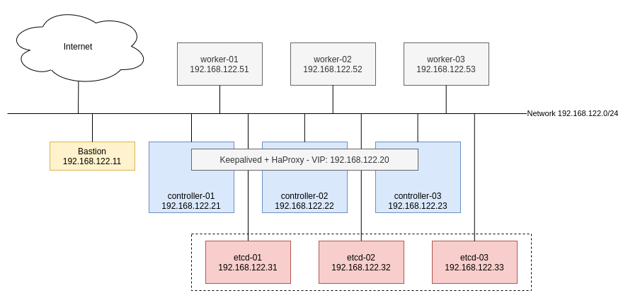

# Kubespray Bare Metal Experiment

## Component Planning



- 3 Etcd VMs:  2 CPU - 2 GB RAM - 40 GB Storage
- 3 K8S Masters: 2 CPU - 4 GB RAM - 40 GB Storage
- 3 K8S Worker: 2 CPU - 3 GB RAM - 40 GB Storage
- Kube API Server Endpoint IP: 192.168.122.10

## Software specs

- Software LB: HaProxy + Keepalived
- OS: CentOS 7
- Container Runtime: containerd (Worker, Master Nodes)
- Etcd deploy type: Host
- K8S version: v1.20.5 (on time writing this document - 03/2021)

## Setup

### 1. Setup K8S Masters

- Setup IP and hostname for K8S Masters
- Disable firewalld and selinux
  ```bash
  systemctl disable firewalld
  systemctl stop firewalld
  sudo setenforce 0
  sudo sed -i 's/^SELINUX=enforcing$/SELINUX=permissive/' /etc/selinux/config
  ```

#### Setup HAProxy 

Install HAProxy and Keepalived and psmisc - foll killall command

```bash
yum -y install keepalived haproxy psmisc
```

Configure HAProxy

```bash
# file /etc/haproxy/haproxy.cfg
# ...
# round robin balancing for apiserver
#---------------------------------------------------------------------
#---------------------------------------------------------------------
# apiserver frontend which proxys to the masters
#---------------------------------------------------------------------
frontend apiserver
    bind *:8443
    mode tcp
    option tcplog
    default_backend apiserver
#---------------------------------------------------------------------
# round robin balancing for apiserver
#---------------------------------------------------------------------
backend apiserver
    option httpchk GET /healthz
    http-check expect status 200
    mode tcp
    option ssl-hello-chk
    balance     roundrobin
        server controller01 192.168.122.21:6443 check
        server controller02 192.168.122.22:6443 check
        server controller03 192.168.122.23:6443 check
```

Restart HAProxy

```bash
sudo systemctl restart haproxy
sudo systemctl enable haproxy
```

#### Setup Keepalived

**In controller01**

Configure Keepalived

```bash
# File /etc/keepalived/keepalived.conf
vrrp_script chk_haproxy {
  script "killall -0 haproxy"
  interval 2
  weight 2
}

vrrp_instance VI_1 {
  interface eth0
  state MASTER
  advert_int 1
  virtual_router_id 21
  priority 101
  unicast_src_ip 192.168.122.21    ##Master 1 IP Address
  unicast_peer {
      192.168.122.22               ##Master 2 IP Address
      192.168.122.23               ##Master 2 IP Address
   }
  virtual_ipaddress {
    192.168.122.20                 ##Shared Virtual IP address
  }
  track_script {
    chk_haproxy
  }
}
```

Restart keepalived

```bash
sudo systemctl start keepalived
sudo systemctl enable keepalived
```

**In controller02**

Configure Keepalived

```bash
# File /etc/keepalived/keepalived.conf
vrrp_script chk_haproxy {
  script "killall -0 haproxy"
  interval 2
  weight 2
}

vrrp_instance VI_1 {
  interface eth0
  state MASTER
  advert_int 1
  virtual_router_id 21
  priority 100
  unicast_src_ip 192.168.122.22    ##Master 1 IP Address
  unicast_peer {
      192.168.122.21               ##Master 2 IP Address
      192.168.122.23               ##Master 2 IP Address
   }
  virtual_ipaddress {
    192.168.122.20                 ##Shared Virtual IP address
  }
  track_script {
    chk_haproxy
  }
}
```

Restart keepalived

```bash
sudo systemctl start keepalived
sudo systemctl enable keepalived
```

**In controller03**

Configure Keepalived

```bash
# File /etc/keepalived/keepalived.conf
vrrp_script chk_haproxy {
  script "killall -0 haproxy"
  interval 2
  weight 2
}

vrrp_instance VI_1 {
  interface eth0
  state MASTER
  advert_int 1
  virtual_router_id 21
  priority 99
  unicast_src_ip 192.168.122.23    ##Master 1 IP Address
  unicast_peer {
      192.168.122.22               ##Master 2 IP Address
      192.168.122.21               ##Master 2 IP Address
   }
  virtual_ipaddress {
    192.168.122.20                 ##Shared Virtual IP address
  }
  track_script {
    chk_haproxy
  }
}
```

Restart keepalived

```bash
sudo systemctl start keepalived
sudo systemctl enable keepalived
```

### 2. Setup Etcd Nodes

- Setup IP and hostname for Etcd Nodes
- Disable firewalld and selinux
  ```bash
  systemctl disable firewalld
  systemctl stop firewalld
  sudo setenforce 0
  sudo sed -i 's/^SELINUX=enforcing$/SELINUX=permissive/' /etc/selinux/config
  ```

### 3. Setup K8S Workers

- Setup IP and hostname for K8S Workers
- Disable firewalld and selinux
  ```bash
  systemctl disable firewalld
  systemctl stop firewalld
  sudo setenforce 0
  sudo sed -i 's/^SELINUX=enforcing$/SELINUX=permissive/' /etc/selinux/config
  ```

### 4. Setup Bastion 

Clone kubespray repo

```bash
git clone https://github.com/kubernetes-sigs/kubespray
```

Setup virtualenv for python3

```bash
virtualenv venv
```

Install required packages

```bash
source venv/bin/active
pip install -r requirements.txt
```

Prepare Inventory File:

```bash
cp -rfp inventory/sample inventory/cluster-01
```

Update Inventory File

```ini
# file inventory/cluster-01/inventory.ini
# ## Configure 'ip' variable to bind kubernetes services on a
# ## different ip than the default iface
# ## We should set etcd_member_name for etcd cluster. The node that is not a etcd member do not need to set the value, or can set the empty string value.
[all]
controller01   ansible_host=192.168.122.21
controller02   ansible_host=192.168.122.22
controller03   ansible_host=192.168.122.23

worker01   ansible_host=192.168.122.51
worker02   ansible_host=192.168.122.52
worker03   ansible_host=192.168.122.53

etcd01   ansible_host=192.168.122.31
etcd02   ansible_host=192.168.122.32
etcd03   ansible_host=192.168.122.33

# ## configure a bastion host if your nodes are not directly reachable
# [bastion]
# bastion ansible_host=x.x.x.x ansible_user=some_user

[kube_control_plane]
controller01
controller02
controller03

[etcd]
etcd01
etcd02
etcd03

[kube-node]
worker01
worker02
worker03

[calico-rr]

[k8s-cluster:children]
kube_control_plane
kube-node
calico-rr
```

Update kubespray configuration files

```yaml
# file inventory/cluster-01/group_vars/k8s-cluster/k8s-cluster.yml
container_manager: containerd
# file inventory/cluster-01/group_vars/etcd.yml
etcd_deployment_type: host
# fileinventory/cluster-01/group_vars/all/all.yml
loadbalancer_apiserver:
   address: 192.168.122.20
   port: 8443
## Deactivate Internal loadbalancers for apiservers at around line 26
loadbalancer_apiserver_localhost: false
```

### 5. Run install command:

```bash
ansible-playbook -i inventory/cluster-01/inventory.ini --user=cloud --ask-pass --ask-become-pass --become --become-method=su --become-user=root cluster.yml
```

### 4. Verify

Login to controller01 VM. Check services:

```log
[root@controller01 cloud]#  kubectl get nodes
NAME           STATUS   ROLES                  AGE     VERSION
controller01   Ready    control-plane,master   3m15s   v1.20.5
controller02   Ready    control-plane,master   2m31s   v1.20.5
controller03   Ready    control-plane,master   2m14s   v1.20.5
worker01       Ready    <none>                 64s     v1.20.5
worker02       Ready    <none>                 64s     v1.20.5
worker03       Ready    <none>                 64s     v1.20.5
[root@controller01 cloud]# kubectl get pods -n kube-system
NAME                                    READY   STATUS    RESTARTS   AGE
calico-kube-controllers-995b884-wdvg8   1/1     Running   0          33s
calico-node-dl6zd                       1/1     Running   0          57s
calico-node-fztmc                       1/1     Running   0          57s
calico-node-gdrps                       1/1     Running   0          57s
calico-node-lwlpr                       1/1     Running   0          57s
calico-node-w8rp2                       1/1     Running   0          57s
calico-node-x5kxz                       1/1     Running   0          57s
coredns-657959df74-v29nm                1/1     Running   0          16s
coredns-657959df74-w72k5                1/1     Running   0          10s
dns-autoscaler-b5c786945-5wrjf          1/1     Running   0          12s
kube-apiserver-controller01             1/1     Running   0          3m14s
kube-apiserver-controller02             1/1     Running   0          2m41s
kube-apiserver-controller03             1/1     Running   0          2m24s
kube-controller-manager-controller01    1/1     Running   0          3m26s
kube-controller-manager-controller02    1/1     Running   0          2m41s
kube-controller-manager-controller03    1/1     Running   0          2m24s
kube-proxy-7g85n                        1/1     Running   0          2m25s
kube-proxy-7mzfz                        1/1     Running   0          2m42s
kube-proxy-c29qd                        1/1     Running   0          75s
kube-proxy-f2s6h                        1/1     Running   0          2m59s
kube-proxy-mpdp5                        1/1     Running   0          75s
kube-proxy-qrpk7                        1/1     Running   0          75s
kube-scheduler-controller01             1/1     Running   0          3m26s
kube-scheduler-controller02             1/1     Running   0          2m41s
kube-scheduler-controller03             1/1     Running   0          2m24s
nodelocaldns-f8vqz                      1/1     Running   0          10s
nodelocaldns-ftfr4                      1/1     Running   0          10s
nodelocaldns-jc7ks                      1/1     Running   0          10s
nodelocaldns-jwkvh                      1/1     Running   0          10s
nodelocaldns-tddz9                      1/1     Running   0          10s
nodelocaldns-vwvg5                      0/1     Running   0          10s

```

## References

- https://github.com/gregbkr/kubernetes-kargo-logging-monitoring
- https://kubernetes.io/docs/setup/production-environment/tools/kubespray/
- https://computingforgeeks.com/deploy-kubernetes-cluster-centos-kubespray/